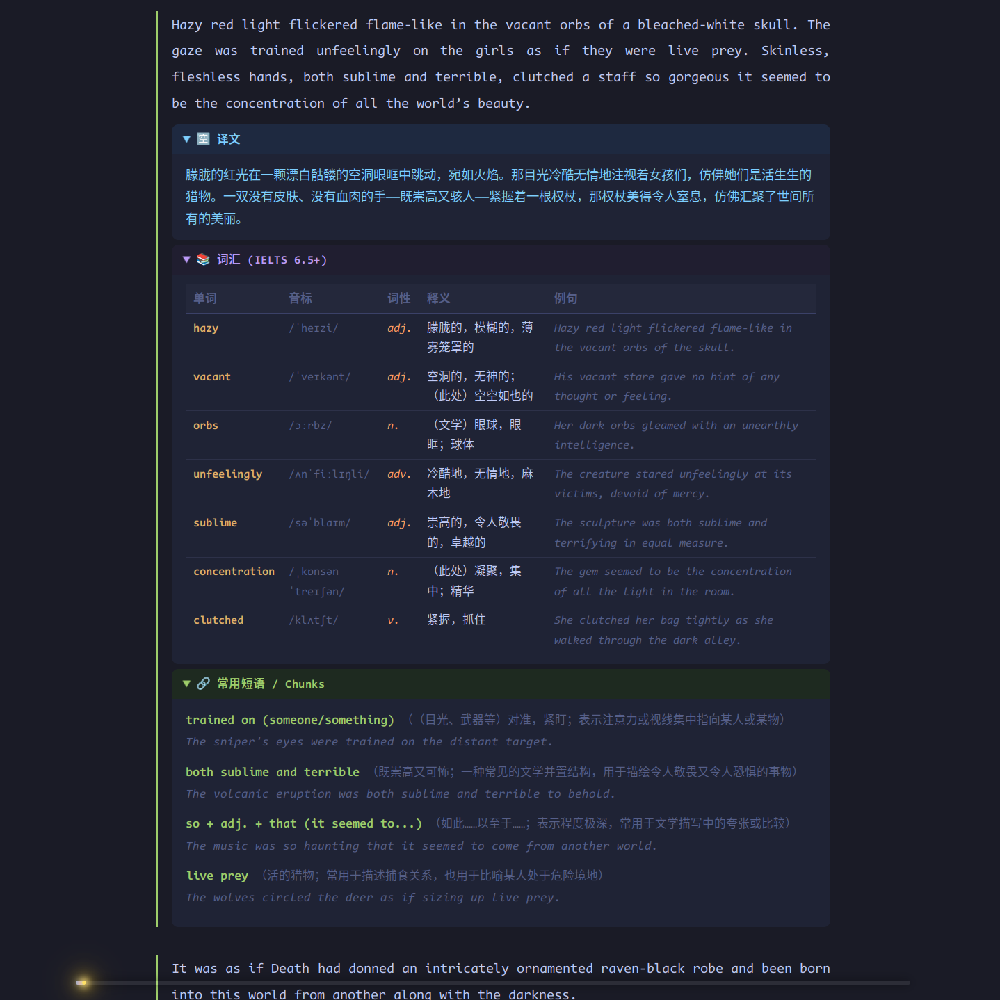

# epub-reader — Light Novel epub → HTML + AI Paragraph Translation

[中文](README.md)

> A batch converter light novel epub files. Outputs styled HTML with collapsible panels, and calls the Claude API to translate each paragraph, extract advanced vocabulary, and highlight useful chunks — with **full resume-after-interrupt support**.



---

## Table of Contents

- [Quick Start](#quick-start)
- [Features](#features)
- [Architecture & Design Principles](#architecture--design-principles)
- [Project Structure](#project-structure)
- [Protocol Reference](#protocol-reference)
  - [Paragraph ID Scheme](#1-paragraph-id-scheme)
  - [HTML Placeholder Format](#2-html-placeholder-format)
  - [LLM Request/Response Protocol](#3-llm-requestresponse-protocol)
  - [Resume Mechanism](#4-resume-mechanism)
  - [Atomic Write Ordering](#5-atomic-write-ordering)
- [HTML Style](#html-style)
- [Output Files](#output-files)
- [Vocabulary & Chunk Standards](#vocabulary--chunk-standards)

---

## Quick Start

### Prerequisites

```bash
# Install Rust (if not already installed)
curl --proto '=https' --tlsv1.2 -sSf https://sh.rustup.rs | sh

# Set your Anthropic API key
export ANTHROPIC_AUTH_TOKEN="xxxxxxxx..."
```

### Build & Run

```bash
cd epub-reader

# Build release binary (faster)
cargo build --release

# Translate all .epub files in a directory (path is required)
cargo run --release -- ../LightNovels

# Or translate a single volume
cargo run --release -- ../LightNovels/vol1.epub

# Custom output directory (default: ./output)
cargo run --release -- ../LightNovels ./my_output

# Offline HTML rebuild from existing state.json (no API calls)
cargo run --release -- --rebuild ../LightNovels
```

### Output Location

```
epub-reader/output/
├── overlord-light-novels-01-the-undead-king.html       ← reading file
├── overlord-light-novels-01-the-undead-king_state.json ← progress archive (do not delete)
├── overlord-light-novels-02-the-dark-warrior.html
├── overlord-light-novels-02-the-dark-warrior_state.json
└── ...
```

### Resuming After Interrupt

Press `Ctrl+C` at any time. Re-run the same command — the program reads `_state.json`, **skips already-translated paragraphs**, and continues from where it left off.

---

## Features

| Feature | Description |
|---|---|
| epub batch parsing | Recursively scan a directory, or pass a single `.epub` file |
| HTML skeleton generation | Each paragraph gets three collapsible panels, initially placeholders |
| Claude API translation | Per-paragraph calls to `claude-sonnet-4-6`, returns structured JSON |
| Live fill-in | After each translation, immediately render JSON into HTML and flush to disk |
| Resume support | State persisted to JSON; interrupted runs continue automatically |
| Error retry | Up to 3 retries per paragraph; one failure doesn't block the rest |
| Offline rebuild | `--rebuild` mode restores HTML from state.json without any API calls |
| Styled output | Tokyo Night color scheme, collapsible panels, scroll progress bar |

---

## Architecture & Design Principles

### Core: ID-keyed, Never Index-keyed

The fundamental mechanism preventing translation/HTML misalignment is that **the paragraph ID is the single key throughout the entire pipeline**. Array indices are never used to associate a translation with its destination slot.

```
epub file
  └─→ parse_epub()
        └─→ Book { paragraphs: [ { id: "...-ch001-p0006", text: "..." }, ... ] }
                                       ↑ ID assigned here, globally unique
                        ┌──────────────┘
                        │  Same Book object used for two things simultaneously:
                        ├─→ html_gen: emits <div id="...-ch001-p0006"> skeleton
                        └─→ pending list: (id, text) pairs
                                               │
                                    sent to LLM (only text; LLM never sees the ID)
                                               │
                                    receive resp
                                               │
                                    patch_html: search HTML for id="...-ch001-p0006"
                                    state.json: { "...-ch001-p0006": resp }
```

**Why misalignment is impossible:**
- The HTML skeleton and the pending list come from **the same in-memory object** — IDs are inherently consistent
- `patch_html` locates the target block by `id="{para_id}"` string search, not by "the Nth `<div>`"
- `state.json` keys are para IDs, not array indices
- Processing is strictly **serial**: send → wait for response → flush to disk → next paragraph. No batch reordering.

### Important Assumption: epub Files Are Immutable

IDs are formatted as `{slug}-ch{chapter}-p{within-chapter-index}`, where `p` restarts from 0 at each chapter. If an epub is modified between runs (paragraphs added or removed), the IDs from the new parse will no longer match the IDs stored in `state.json` — translations will land in the wrong slots. **Do not modify epub files after starting translation.** If you need to restart, delete the corresponding `.html` and `_state.json` files and run again from scratch.

### Crash-Safe Write Ordering

```
in-memory patch → write .html.tmp → rename() → write _state.json
```

HTML is always written before state. The worst case at any crash point is "re-translate one paragraph" (costs one extra API call), never "state says done but HTML placeholder is permanent." `rename()` is an atomic POSIX syscall — the `.html` file is always either the old version or the new version, never a partial write.

### Output File Naming

File names are derived from the epub's **internal metadata title** (`mdata("title")`), processed through `slugify()` into a URL-safe string. The epub filename on disk is irrelevant. Anna's Archive filenames append author, year, ISBN, and hash — the metadata title stays clean. As long as the metadata title is consistent, the output filename (and thus `state.json`) is reusable regardless of how the epub file is named.

---

## Project Structure

```
epub-reader/
├── Cargo.toml
└── src/
    ├── main.rs          # Entry point: scan → parse → generate HTML → LLM translate
    ├── types.rs         # Core data structures (Book / Paragraph / LlmResponse etc.)
    ├── epub_parser.rs   # epub parsing: spine traversal + paragraph extraction
    ├── html_gen.rs      # HTML generation (skeleton), paragraph rendering, in-place patch
    ├── llm_client.rs    # Anthropic Messages API wrapper
    └── state.rs         # Resume state read/write (JSON file)
```

---

## Protocol Reference

### 1. Paragraph ID Scheme

Every paragraph has a **globally unique ID** within a book:

```
{book-slug}-ch{chapter:03}-p{para:04}
```

Example:

```
overlord-light-novels-01-the-undead-king-ch002-p0017
│                                          │    │
│                                          │    └─ 17th paragraph in this chapter
│                                          │       (4-digit zero-padded, resets to p0000 each chapter)
│                                          └────── Chapter 2 (3-digit zero-padded, starts at ch000)
└───────────────────────────────────────── book slug (from epub metadata title, URL-safe)
```

> **Note:** `p` is the **within-chapter** index, not a global paragraph count. The progress bar's global count and the `p` in the ID are two different numbers.

This ID is used for:
- The HTML `<div>` `id` attribute (browser anchor: `#overlord-...-ch002-p0017`)
- The `_state.json` key (resume: determines which paragraphs are already done)

---

### 2. HTML Placeholder Format

Each paragraph renders as:

```html
<!-- Before translation (data-status="pending", grey left border) -->
<div class="para-block" id="overlord-...-ch002-p0017" data-status="pending">
  <p class="original-text">Original English paragraph...</p>

  <details class="ai-section translation-section">
    <summary>🈳 译文</summary>
    <div class="ai-content"><!-- FILL:translation --></div>
  </details>

  <details class="ai-section vocab-section">
    <summary>📚 词汇 (IELTS 6.5+)</summary>
    <div class="ai-content"><!-- FILL:vocab --></div>
  </details>

  <details class="ai-section chunk-section">
    <summary>🔗 常用短语 / Chunks</summary>
    <div class="ai-content"><!-- FILL:chunks --></div>
  </details>
</div>
```

**Fill-in targeting:** The program searches the HTML string for `id="{para_id}"`, locates the enclosing `<div>` block using a brace-depth counter, and replaces the entire block in-memory.

---

### 3. LLM Request/Response Protocol

Claude is instructed to reply in **pure JSON** (no markdown fences):

```json
{
  "translation": "Full Chinese translation, natural and faithful to the original style",
  "vocabulary": [
    {
      "word":    "word or phrase",
      "ipa":     "IPA pronunciation",
      "pos":     "part of speech (n./v./adj./adv./phrase)",
      "cn":      "Chinese definition",
      "example": "English example sentence"
    }
  ],
  "chunks": [
    {
      "chunk":   "idiomatic phrase / collocation / pattern",
      "cn":      "Chinese explanation and usage notes",
      "example": "English example sentence"
    }
  ]
}
```

#### Selection Criteria

- `vocabulary`: Only words at **IELTS ≥ 6.5 (C1/C2)** difficulty, 3–8 per paragraph, skip common words
- `chunks`: 2–5 native-speaker collocations, fixed expressions, or sentence patterns worth imitating

#### Error Tolerance

- Unexpected ` ```json ` fences: automatically stripped
- Missing `:` between key and array/object: automatically inserted
- Unescaped `"` inside string values (e.g. Chinese dialogue): automatically escaped
- JSON parse failure after all repairs: paragraph skipped with a warning, processing continues
- Network/API errors: up to 3 retries with exponential backoff (2s, 4s, 6s)

---

### 4. Resume Mechanism

```
First run:
  epub file ──parse──→ Book (paragraphs with IDs)
                         ├──→ generate HTML skeleton (all data-status="pending")
                         └──→ pending list = all paragraphs
                                │
                          translate each paragraph via Claude API
                          after each: patch HTML → write state
                                ...
                    ← Ctrl+C interrupt →

Second run (resume):
  1. Load existing .html file (retains all already-filled content)
  2. Load _state.json → pending = all paragraphs − completed
  3. Only translate pending paragraphs
  4. If all done: print "All paragraphs already translated." and exit (no API calls)
```

---

### 5. Atomic Write Ordering

```
in-memory patch → write .html.tmp → rename(.html.tmp → .html) → write _state.json
```

| Crash point | Consequence | Next run |
|---|---|---|
| Before HTML write | state not updated | re-translate (1 extra API call, no data loss) |
| After HTML, before state | HTML already filled | re-translate and overwrite (same result, 1 extra API call) |
| After state write | fully recorded | skip ✓ |

Writing state before HTML (the wrong order) would cause: state says "done" but HTML still has `<!-- FILL:xxx -->` — a **permanent unfillable hole** since the program will never re-translate a paragraph marked done in state.

---

## HTML Style

**Tokyo Night** dark color scheme. All styles are inlined — no external CSS files required.

| Element | Visual |
|---|---|
| Untranslated paragraph | Grey left border |
| Translated paragraph | Green left border |
| Translation panel | Dark blue background, cyan text |
| Vocabulary panel | Dark purple background, purple heading |
| Chunks panel | Dark green background, green heading |
| Word | Yellow highlight |
| IPA | Monospace font, grey |
| Part of speech | Orange italic |
| Scroll progress bar | Updates in real-time as you scroll |

---

## Output Files

| File | Purpose | Safe to delete? |
|---|---|---|
| `{slug}.html` | Final reading file, open in browser | Yes — regenerate with `--rebuild` |
| `{slug}_state.json` | Translation progress archive | **No** — deleting means re-translating from scratch |

---

## Vocabulary & Chunk Standards

### IELTS Difficulty Reference

| Level | CEFR | Example words |
|---|---|---|
| Selected ✓ | C1/C2 | ephemeral, nefarious, implacable, brandish |
| Not selected ✗ | A1–B2 | good, important, suddenly, however |

### Chunk Selection Principles

Prefer:
1. **Verb-phrase collocations**: `hold one's ground`, `lay siege to`
2. **Fixed expressions**: `as if by instinct`, `at the mercy of`
3. **Literary sentence patterns**: inversions, participial structures worth imitating
4. **High-scoring expressions usable in IELTS/TOEFL writing**
